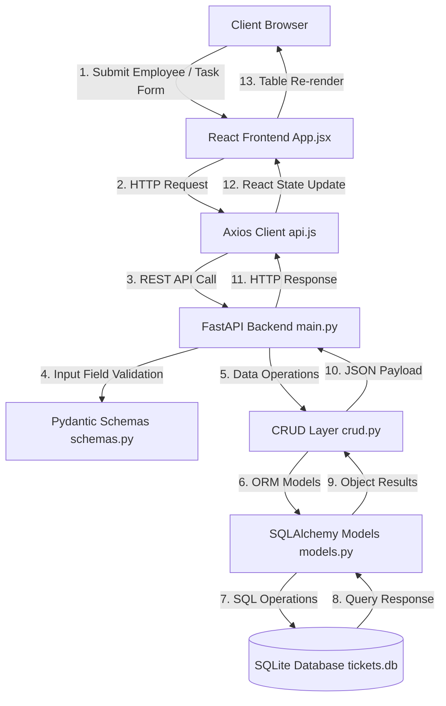

# 🚀 Employee Task Tracker — Core Case Study Documentation

This document provides the strict technical documentation for the **Employee Task Tracker** application adhering strictly to the core requirements specified in `Employee_Task_Tracker_Case_Study 1.pdf`.

---

## 1. 🛠️ System Overview & Tech Stack

The **Employee Task Tracker** is a minimal backend & frontend application designed to manage employees and track their assigned tasks.

> [!IMPORTANT]
> **Strict Core Implementation**: All optional extensions (JWT authentication, task priority, timestamps, pagination, filtering) have been omitted as requested.

### Technology Stack

| Layer | Technology | Description |
| :--- | :--- | :--- |
| **Backend Framework** | FastAPI (Python) | Exposes standard REST endpoints and OpenAPI docs at `/docs` |
| **Database** | SQLite (`tickets.db`) | Relational database storage |
| **ORM** | SQLAlchemy | Maps Python models to database tables |
| **Input Validation** | Pydantic v2 | Enforces non-empty input field constraints |
| **Frontend Framework** | React 18 & Vite | Lightweight client-side application |
| **Styling** | Tailwind CSS | Clean, minimal user interface |

---

## 2. 🔄 End-to-End System Workflow

---

## 3. 🐍 Backend Component Breakdown (`backend/`)

#### 1. [`models.py`](file:///d:/STUDY/NOTES/CAPGEMINI%20TRAINING/FastApi/CASE%20STUDY/backend/models.py)
- **`Employee`**: `id` (Auto PK), `name` (String, Non-empty).
- **`Task`**: `id` (Auto PK), `title` (String, Non-empty), `status` (Default: `"Pending"`), `employee_id` (FK to `employees.id`).

#### 2. [`schemas.py`](file:///d:/STUDY/NOTES/CAPGEMINI%20TRAINING/FastApi/CASE%20STUDY/backend/schemas.py)
- **`EmployeeCreate`**: Requires non-empty name (`min_length=1`).
- **`TaskCreate`**: Requires non-empty title (`min_length=1`) and valid `employee_id`. Default status: `"Pending"`.
- **`TaskStatusUpdate`**: Validates status updates (`Pending`, `In-Progress`, `Completed`).

#### 3. [`crud.py`](file:///d:/STUDY/NOTES/CAPGEMINI%20TRAINING/FastApi/CASE%20STUDY/backend/crud.py)
- Methods: `create_employee()`, `get_all_employees()`, `get_employee_by_id()`, `create_task()`, `get_all_tasks()`, `get_tasks_by_employee()`, `update_task_status()`.

#### 4. [`main.py`](file:///d:/STUDY/NOTES/CAPGEMINI%20TRAINING/FastApi/CASE%20STUDY/backend/main.py)
- Exposes the 5 core PDF endpoints:
  - `POST /employees/` - Create new employee
  - `GET /employees/{employee_id}/tasks` - Get all tasks for an employee
  - `POST /tasks/` - Create new task
  - `GET /tasks/` - List all tasks in the system
  - `PUT /tasks/{task_id}` - Update task status

---

## 4. ⚛️ Frontend Component Breakdown (`frontend/`)

- **[`src/App.jsx`](file:///d:/STUDY/NOTES/CAPGEMINI%20TRAINING/FastApi/CASE%20STUDY/frontend/src/App.jsx)**:
  - Main component displaying header, **+ Add Employee** button, **+ Add Task** button, employee task filter selector, and task table with inline status dropdowns.
- **[`src/services/api.js`](file:///d:/STUDY/NOTES/CAPGEMINI%20TRAINING/FastApi/CASE%20STUDY/frontend/src/services/api.js)**:
  - Axios client handling calls to `/employees/`, `/tasks/`, `/employees/{id}/tasks`, and `/tasks/{id}`.

---

## 5. 📑 REST API Endpoint Summary

| HTTP Method | Route Endpoint | Description | Constraints & Validation |
| :---: | :--- | :--- | :--- |
| `POST` | `/employees/` | Create a new employee | Employee name must not be empty |
| `GET` | `/employees/` | List all employees | Returns array of employees |
| `GET` | `/employees/{employee_id}/tasks` | Get all tasks of a specific employee | Validates employee existence |
| `POST` | `/tasks/` | Create a new task | Task title non-empty, valid employee ID |
| `GET` | `/tasks/` | Get all tasks in system | Returns array of tasks |
| `PUT` | `/tasks/{task_id}` | Update task status | Status must be: `Pending`, `In-Progress`, `Completed` |
