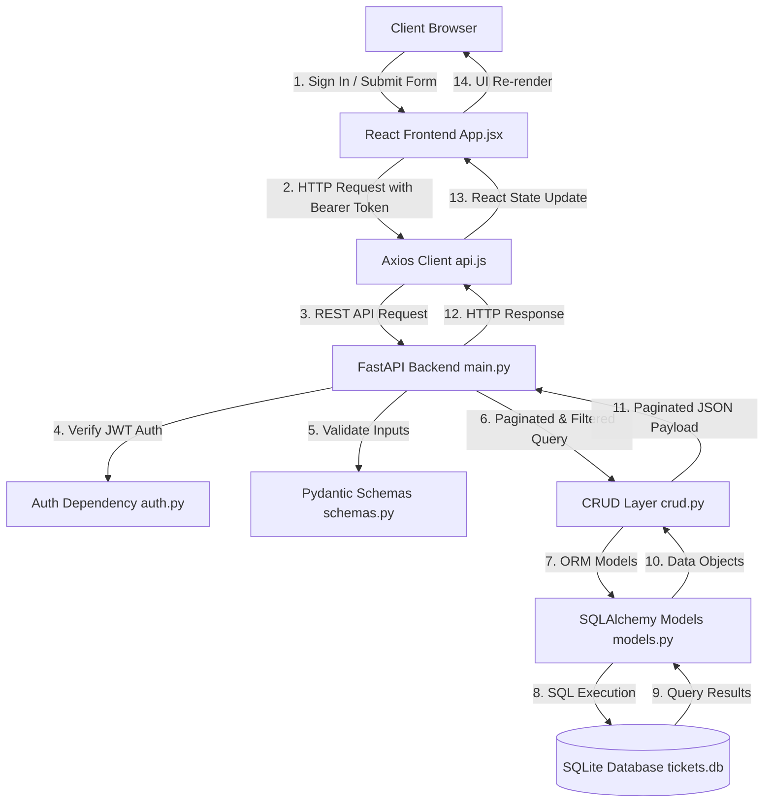

# 🚀 Employee Task Tracker — System Architecture & Complete Feature Guide

This document provides complete technical documentation for the **Employee Task Tracker** application, detailing all system architecture, core specs, and advanced features.

---

## 1. 🌐 Live Deployment & Links

- 🚀 **Live Application Demo**: [https://fast-api-case-study-bwuuu3280-anshuls-projects-42761997.vercel.app](https://fast-api-case-study-bwuuu3280-anshuls-projects-42761997.vercel.app)
- 🐙 **GitHub Repository**: [https://github.com/Anshulnand/FastAPI-Case-Study](https://github.com/Anshulnand/FastAPI-Case-Study)

---

## 2. 🌟 Comprehensive Feature Catalog

### 🔐 1. Authentication & Security (JWT)
- **User Registration (`POST /auth/register`)**: Register new user accounts with full name, email, password, and system role (`employee` or `admin`).
- **User Login (`POST /auth/login`)**: Validates credentials against hashed passwords (`pbkdf2_sha256`) and issues a signed JSON Web Token (JWT with 24-hour expiry).
- **Authenticated Profile (`GET /auth/me`)**: Retrieves current user profile using `Authorization: Bearer <token>` headers.
- **Axios Token Interceptor**: Automatically attaches the stored JWT token to all outbound HTTP API requests.
- **Auth UI Modal**: Tabbed Sign In and Account Registration view with **1-click autofill presets** for `Employee Demo` (`employee@company.com`) and `Admin Demo` (`admin@company.com`).
- **Persistent User Session**: User details and tokens stored in `localStorage` with a live user state indicator and logout button in the header.

### ⏱️ 2. Task Timestamps & Audit Tracking
- **Creation Timestamp (`created_at`)**: Automatically records the UTC timestamp when a task is created.
- **Update Timestamp (`updated_at`)**: Automatically updates whenever a task's status or priority is modified.
- **Formatted UI Display**: Rendered on each task card as formatted dates (e.g., `Created: Aug 11, 22:30` / `Updated: Aug 11, 22:35`) with clock indicators.

### 🏷️ 3. Task Priority Levels
- **4-Tier Priority System**: Tasks can be categorized into `Low`, `Medium`, `High`, and `Urgent` priority.
- **Distinct Color-Coded Badges**:
  - 🔴 **Urgent**: Rose/Red badge (`bg-rose-50 text-rose-700 border-rose-200`)
  - 🟠 **High**: Orange/Amber badge (`bg-orange-50 text-orange-700 border-orange-200`)
  - 🔵 **Medium**: Blue badge (`bg-sky-50 text-sky-700 border-sky-200`)
  - ⚪ **Low**: Slate/Gray badge (`bg-slate-100 text-slate-600 border-slate-200`)
- **Priority Selector**: Selectable during task creation modal and modifiable directly via an inline priority dropdown on task cards.

### 📑 4. Server-Side Pagination
- **API Query Parameters**: `page` (1-indexed) and `limit` (page size).
- **Structured Response (`PaginatedTaskResponse`)**:
  ```json
  {
    "items": [...],
    "total": 15,
    "page": 1,
    "limit": 6,
    "total_pages": 3
  }
  ```
- **Interactive UI Pagination Controls**:
  - `← Previous` and `Next →` navigation buttons with disabled state at boundaries.
  - Page indicator badge (`Page X of Y`).
  - Items per page dropdown selector (`3`, `6`, `12`, `24` tasks per page).
  - Total items counter (`Total: N tasks`).

### 🔍 5. Multi-Criteria Task Filtering & Real-Time Search
- **Status Filter**: Filter task list by status (`All Statuses`, `Pending`, `In-Progress`, `Completed`).
- **Priority Filter**: Filter task list by priority (`All Priorities`, `Low`, `Medium`, `High`, `Urgent`).
- **Employee Filter**: Filter tasks by assigned employee (`GET /tasks?employee_id=X`).
- **Real-Time Keyword Search**: Instant title search matching keyword input (`GET /tasks?search=...`).
- **Reset All Filters Button**: One-click action to restore default unfiltered view.

### 👥 6. Employee & Task CRUD Management (Core Specs)
- **Create Employee (`POST /employees/`)**: Validates non-empty employee name using Pydantic.
- **List Employees (`GET /employees/`)**: Fetches all employees for selection dropdowns.
- **Create Task (`POST /tasks/`)**: Links task to valid employee ID, validates non-empty title.
- **Update Task Status (`PUT /tasks/{task_id}`)**: Enforces status lifecycle constraint (`Pending`, `In-Progress`, `Completed`).
- **Live Summary Metrics**: Real-time summary metric cards displaying Total, Pending, In-Progress, and Completed task counts.

### ⚡ 7. Auto DB Schema Migration & Pre-Seeded Users
- **SQLite Auto-Migration Helper (`ensure_db_schema()`)**: Automatically detects and adds missing table columns (`priority`, `created_at`, `updated_at`, `users` table) without losing existing data.
- **Pre-Seeded Accounts**: Auto-seeds demo accounts (`admin@company.com` / `admin123` and `employee@company.com` / `emp123`) on app startup.

---

## 3. 🛠️ System Overview & Tech Stack

| Layer | Technology | Description |
| :--- | :--- | :--- |
| **Backend Framework** | FastAPI (Python) | Exposes REST APIs and OpenAPI Swagger docs at `/docs` |
| **Authentication** | JWT (python-jose & passlib) | Token authentication & password hashing |
| **Database** | SQLite (`tickets.db`) | Relational database storage |
| **ORM** | SQLAlchemy | Maps Python models (`User`, `Employee`, `Task`) to database tables |
| **Input Validation** | Pydantic v2 | Enforces non-empty field validation and enum constraints |
| **Frontend Framework** | React 18 & Vite | Client dashboard app |
| **Styling** | Tailwind CSS | Modern interface with dark/light glassmorphism accents |

---

## 4. 🔄 System Dataflow Architecture



---

## 5. 🐍 Backend Component Breakdown (`backend/`)

#### 1. [`auth.py`](file:///d:/STUDY/NOTES/CAPGEMINI%20TRAINING/FastApi/CASE%20STUDY/backend/auth.py)
- Password hashing with `pbkdf2_sha256`.
- JWT token generation with `jose.jwt` (24 hour expiration).
- Dependency `get_current_user` for token extraction and authentication.

#### 2. [`models.py`](file:///d:/STUDY/NOTES/CAPGEMINI%20TRAINING/FastApi/CASE%20STUDY/backend/models.py)
- `User`: `id`, `name`, `email`, `hashed_password`, `role`, `created_at`.
- `Employee`: `id`, `name`.
- `Task`: `id`, `title`, `status`, `priority`, `employee_id`, `created_at`, `updated_at`.

#### 3. [`schemas.py`](file:///d:/STUDY/NOTES/CAPGEMINI%20TRAINING/FastApi/CASE%20STUDY/backend/schemas.py)
- Auth schemas: `UserCreate`, `UserLogin`, `UserResponse`, `Token`.
- Task schemas: `TaskCreate`, `TaskStatusUpdate`, `TaskResponse`, `PaginatedTaskResponse`.

#### 4. [`crud.py`](file:///d:/STUDY/NOTES/CAPGEMINI%20TRAINING/FastApi/CASE%20STUDY/backend/crud.py)
- Database CRUD functions: `create_user()`, `get_user_by_email()`, `create_employee()`, `get_all_employees()`, `create_task()`, `get_paginated_tasks()`, `update_task_status()`.

#### 5. [`main.py`](file:///d:/STUDY/NOTES/CAPGEMINI%20TRAINING/FastApi/CASE%20STUDY/backend/main.py)
- Application entry point with schema migration, demo seeder, CORS middleware, and API endpoints.

---

## 6. ⚛️ Frontend Component Breakdown (`frontend/`)

- **[`src/App.jsx`](file:///d:/STUDY/NOTES/CAPGEMINI%20TRAINING/FastApi/CASE%20STUDY/frontend/src/App.jsx)**: Main interface component with metric cards, filter bar, task grid, pagination, and modals.
- **[`src/components/AuthModal.jsx`](file:///d:/STUDY/NOTES/CAPGEMINI%20TRAINING/FastApi/CASE%20STUDY/frontend/src/components/AuthModal.jsx)**: Authentication modal with login, registration, and quick demo preset buttons.
- **[`src/services/api.js`](file:///d:/STUDY/NOTES/CAPGEMINI%20TRAINING/FastApi/CASE%20STUDY/frontend/src/services/api.js)**: Axios API client with token interceptor and mock fallbacks.

---

## 7. 📑 REST API Endpoint Reference

| HTTP Method | Route Endpoint | Description | Query / Body Parameters |
| :---: | :--- | :--- | :--- |
| `POST` | `/auth/register` | Register user account | JSON body: `{ name, email, password, role }` |
| `POST` | `/auth/login` | Authenticate user & issue JWT | JSON body: `{ email, password }` |
| `GET` | `/auth/me` | Fetch authenticated profile | Bearer Token header |
| `POST` | `/employees/` | Create employee record | JSON body: `{ name }` |
| `GET` | `/employees/` | List all employees | None |
| `GET` | `/employees/{id}/tasks` | Get tasks by employee | Path param: `employee_id` |
| `POST` | `/tasks/` | Create a new task | JSON body: `{ title, employee_id, status, priority }` |
| `GET` | `/tasks/` | List tasks (Filtered & Paginated) | Query params: `page`, `limit`, `status`, `priority`, `employee_id`, `search` |
| `PUT` | `/tasks/{task_id}` | Update task status or priority | JSON body: `{ status, priority }` |
