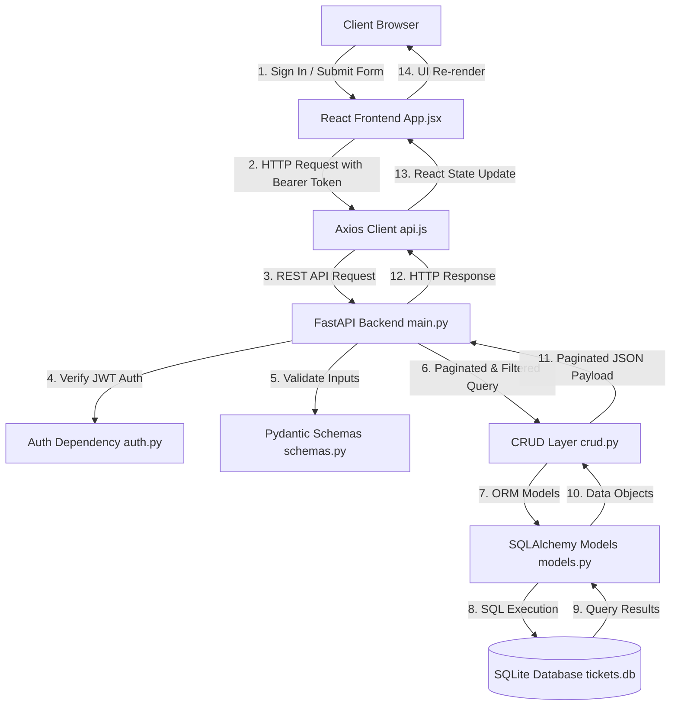

# 🚀 Employee Task Tracker — System Architecture & Workflow

This document provides technical documentation for the **Employee Task Tracker** application, including JWT authentication, task priority, timestamps, pagination, and multi-criteria filtering.

---

## 1. 🌐 Live Deployment & Links

- 🚀 **Live Application Demo**: [https://fast-api-case-study-bwuuu3280-anshuls-projects-42761997.vercel.app](https://fast-api-case-study-bwuuu3280-anshuls-projects-42761997.vercel.app)
- 🐙 **GitHub Repository**: [https://github.com/Anshulnand/FastAPI-Case-Study](https://github.com/Anshulnand/FastAPI-Case-Study)

---

## 2. 🛠️ System Overview & Tech Stack

The **Employee Task Tracker** is a full-stack task assignment and lifecycle status application.

### Technology Stack

| Layer | Technology | Description |
| :--- | :--- | :--- |
| **Backend Framework** | FastAPI (Python) | Exposes REST APIs and OpenAPI Swagger docs at `/docs` |
| **Authentication** | JWT (python-jose & passlib) | Token authentication & password hashing |
| **Database** | SQLite (`tickets.db`) | Relational database storage |
| **ORM** | SQLAlchemy | Maps Python models (`User`, `Employee`, `Task`) to database tables |
| **Input Validation** | Pydantic v2 | Enforces non-empty field validation and enum constraints |
| **Frontend Framework** | React 18 & Vite | Client dashboard app |
| **Styling** | Tailwind CSS | Modern interface with dark/light glassmorphism accents |

---

## 3. 🔄 System Dataflow Architecture

---

## 4. 🐍 Backend Component Breakdown (`backend/`)

#### 1. [`auth.py`](file:///d:/STUDY/NOTES/CAPGEMINI%20TRAINING/FastApi/CASE%20STUDY/backend/auth.py)
- **Password Hashing**: Secure hashing with `pbkdf2_sha256`.
- **JWT Token Generation**: Signed tokens created with `jose.jwt` (24 hour expiration).
- **Dependencies**: `get_current_user` extracts and validates the HTTP Bearer token.

#### 2. [`models.py`](file:///d:/STUDY/NOTES/CAPGEMINI%20TRAINING/FastApi/CASE%20STUDY/backend/models.py)
- **`User`**: `id`, `name`, `email`, `hashed_password`, `role` (`employee` / `admin`), `created_at`.
- **`Employee`**: `id`, `name`.
- **`Task`**: `id`, `title`, `status` (`Pending`, `In-Progress`, `Completed`), `priority` (`Low`, `Medium`, `High`, `Urgent`), `employee_id`, `created_at`, `updated_at`.

#### 3. [`schemas.py`](file:///d:/STUDY/NOTES/CAPGEMINI%20TRAINING/FastApi/CASE%20STUDY/backend/schemas.py)
- **`UserCreate`**, **`UserLogin`**, **`UserResponse`**, **`Token`**: User authentication payloads.
- **`TaskCreate`**: Title, employee ID, initial status, and priority.
- **`TaskResponse`**: Detailed task response including timestamps (`created_at`, `updated_at`) and priority.
- **`PaginatedTaskResponse`**: Structured wrapper (`items`, `total`, `page`, `limit`, `total_pages`).

#### 4. [`crud.py`](file:///d:/STUDY/NOTES/CAPGEMINI%20TRAINING/FastApi/CASE%20STUDY/backend/crud.py)
- Methods: `create_user()`, `get_user_by_email()`, `create_employee()`, `get_all_employees()`, `create_task()`, `get_paginated_tasks()`, `update_task_status()`.

#### 5. [`main.py`](file:///d:/STUDY/NOTES/CAPGEMINI%20TRAINING/FastApi/CASE%20STUDY/backend/main.py)
- Auto DB Schema migration check (`ensure_db_schema()`).
- Default user seeder (`admin@company.com` and `employee@company.com`).
- Endpoints:
  - `POST /auth/register` & `POST /auth/login`
  - `GET /auth/me`
  - `POST /employees/` & `GET /employees/`
  - `GET /employees/{employee_id}/tasks`
  - `POST /tasks/` & `GET /tasks/` (Paginated & Filtered)
  - `PUT /tasks/{task_id}`

---

## 5. ⚛️ Frontend Component Breakdown (`frontend/`)

- **[`src/App.jsx`](file:///d:/STUDY/NOTES/CAPGEMINI%20TRAINING/FastApi/CASE%20STUDY/frontend/src/App.jsx)**:
  - Main app interface containing metric cards, filter toolbar (Search, Status, Priority, Employee), task card grid, and pagination controls.
- **[`src/components/AuthModal.jsx`](file:///d:/STUDY/NOTES/CAPGEMINI%20TRAINING/FastApi/CASE%20STUDY/frontend/src/components/AuthModal.jsx)**:
  - Sign in / Registration modal with quick demo autofill buttons.
- **[`src/services/api.js`](file:///d:/STUDY/NOTES/CAPGEMINI%20TRAINING/FastApi/CASE%20STUDY/frontend/src/services/api.js)**:
  - Axios API wrapper with request interceptors attaching JWT authorization tokens.

---

## 6. 📑 REST API Endpoint Reference

| HTTP Method | Route Endpoint | Description | Query / Body Parameters |
| :---: | :--- | :--- | :--- |
| `POST` | `/auth/register` | Register user account | JSON body: `{ name, email, password, role }` |
| `POST` | `/auth/login` | Authenticate user & issue JWT | JSON body: `{ email, password }` |
| `GET` | `/auth/me` | Fetch authenticated profile | Bearer Token header |
| `POST` | `/employees/` | Create employee record | JSON body: `{ name }` |
| `GET` | `/employees/` | List all employees | None |
| `GET` | `/employees/{id}/tasks` | Get tasks by employee | Path param: `employee_id` |
| `POST` | `/tasks/` | Create a new task | JSON body: `{ title, employee_id, status, priority }` |
| `GET` | `/tasks/` | List tasks (Filtered & Paginated) | Query params: `page`, `limit`, `status`, `priority`, `employee_id`, `search` |
| `PUT` | `/tasks/{task_id}` | Update task status or priority | JSON body: `{ status, priority }` |
